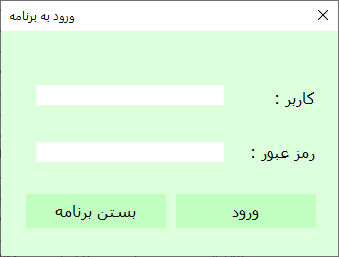

# Product Manager

Minimal shopping center management program to practice some aspect oriented programming, sql, old c# and main topics in desktop app development.

Features ;
- create item
- create buy and sell invoices
- multi inventory
- manually adding new prices for items over time
(these prices will be used in invoices according to the invoice date)
- user management
- ...

Code is not clean, but at least it works.

Also there is no script to create proper tables in the database, but maybe one day I will add them.

## Screenshots :

***Login page***

***Entities list***

***Invoice***

